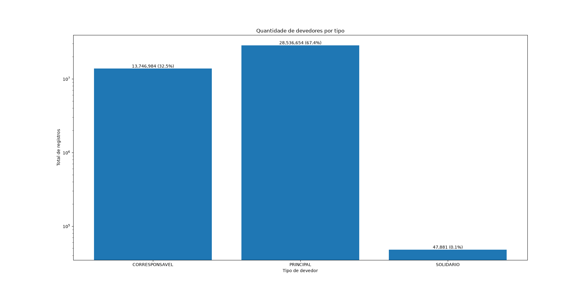
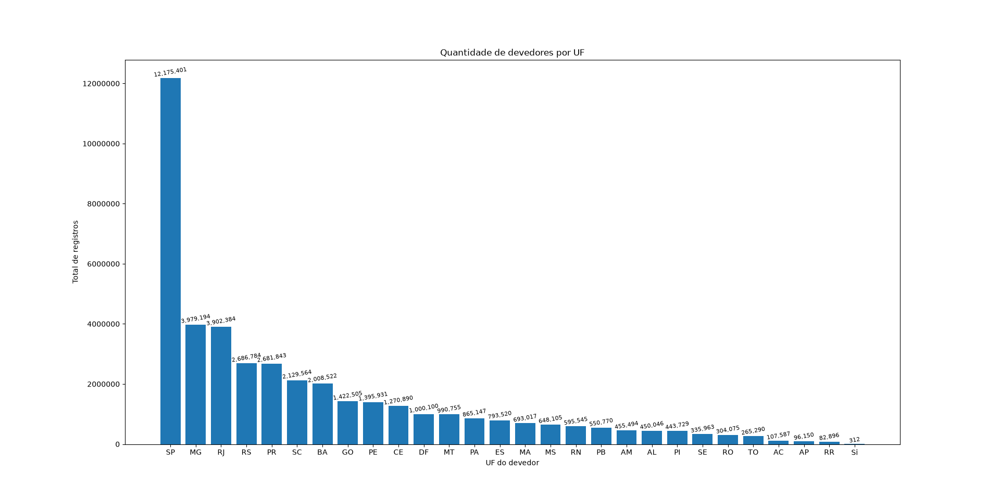
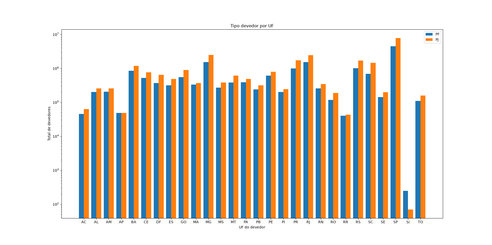
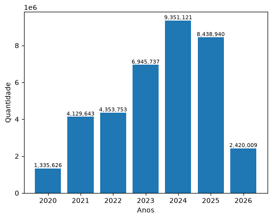
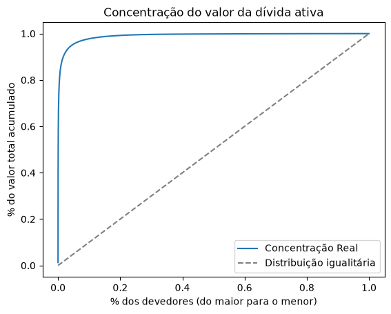

# ETL - Dívida Ativa Não Previdenciária (PGFN)

Pipeline ETL para processamento dos dados públicos de dívida ativa não previdenciária da Procuradoria-Geral da Fazenda Nacional (PGFN).

## Fonte dos dados

Os dados são disponibilizados publicamente em:
https://dadosabertos.pgfn.gov.br/

O arquivo utilizado é o `Dados_abertos_Nao_Previdenciario.zip`, que contém 6 arquivos CSV separados por `;` com encoding `latin1`, totalizando aproximadamente 42 milhões de linhas e 8GB de dados.

## Estrutura do projeto

```
etl-pgfn/
├── .env                  # credenciais do banco (não vai ao git)
├── .gitignore
├── requirements.txt
├── main.py               # orquestra o pipeline E → T → L
├── data/
│   └── raw/              # local para armazenar os CSVs originais
└── src/
    ├── extract.py        # leitura dos arquivos CSV
    ├── transform.py      # limpeza e transformação dos dados
    └── load.py           # carregamento no PostgreSQL
```

## Como executar

### 1. Instalar dependências

```bash
pip install -r requirements.txt
```

### 2. Configurar o arquivo `.env`

Crie um arquivo `.env` na raiz do projeto com as credenciais do banco:

```
DB_HOST=localhost
DB_PORT=5432
DB_NAME=postgres
DB_USER=postgres
DB_PASSWORD=sua_senha
```

### 3. Baixar os dados

Acesse https://dadosabertos.pgfn.gov.br/ e baixe o arquivo `Dados_abertos_Nao_Previdenciario.zip`. Extraia os CSVs e atualize o caminho no `main.py`.

### 4. Executar o pipeline

```bash
python main.py
```

## Stack

| Biblioteca | Função |
|---|---|
| `pandas` | Leitura e transformação dos CSVs |
| `sqlalchemy` | Conexão com o PostgreSQL |
| `psycopg2-binary` | Driver do PostgreSQL para Python |
| `python-dotenv` | Leitura das credenciais do `.env` |

## Decisões técnicas

### Separação em extract / transform / load
Cada etapa do pipeline tem seu próprio arquivo com responsabilidade única. Isso facilita a manutenção — se o banco mudar, só o `load.py` precisa ser alterado.

### Credenciais no `.env`
A senha do banco nunca entra no código-fonte nem vai ao repositório. O `.env` está no `.gitignore`.

### Encoding `latin1`
Arquivos do governo brasileiro geralmente usam `latin1` (ISO-8859-1), o encoding padrão do Windows, em vez de `UTF-8`.

### Processamento arquivo por arquivo
A tentativa inicial era carregar os 6 arquivos de uma vez com `pd.concat()`. Isso causou `MemoryError` pois os dados descomprimidos excedem a RAM disponível. A solução foi processar um arquivo por vez no loop do `main.py`, usando `if_exists="replace"` no primeiro e `if_exists="append"` nos demais.

## Transformações aplicadas

| Coluna | Tipo original | Tipo final | Motivo |
|---|---|---|---|
| `DATA_INSCRICAO` | str | datetime | Permite filtros e cálculos por data |
| `INDICADOR_AJUIZADO` | str (SIM/NAO) | bool | Ocupa menos espaço, consultas mais limpas |
| `NUMERO_INSCRICAO` | float64 | str | É um código identificador, não um valor numérico |
| Colunas de texto | object | object | Aplicado `.strip()` para remover espaços nas bordas |


## Análise dos dados

Após carregar os dados no PostgreSQL, comecei a trabalhar nas análises exploratórias (`src/analise.py`). O tamanho do arquivo (42 milhões de linhas) trouxe desafios de performance que mudaram bastante a abordagem:

**Tentativa 1 — trazer a tabela inteira:** a primeira ideia foi simplesmente trazer todos os 42 milhões de linhas para o pandas com `SELECT *`. Inviável — travou.

**Tentativa 2 — amostragem com pandas:** reduzi para uma amostra com `SELECT * ... ORDER BY RANDOM() LIMIT 100000`, usando `RANDOM()` para que a amostra fosse mais representativa do que simplesmente pegar as primeiras 100.000 linhas. Mesmo limitando a 100.000 linhas, o processamento em pandas (filtros e `groupby` em memória) continuou inviável.

**Tentativa 3 — agregações via SQL:** decidi deixar o PostgreSQL fazer o trabalho pesado, escrevendo queries com `GROUP BY` e `COUNT(*)` que agregam os dados direto no banco, trazendo para o pandas apenas o resultado já resumido (poucas linhas) em vez de dados brutos. O ganho de desempenho foi enorme: uma consulta que antes levava cerca de 1 hora e ainda terminava em erro passou a rodar em cerca de 1 minuto.

**Lição aprendida:** para arquivos grandes, processamento agregado (`GROUP BY`/`COUNT`) deve ser feito no banco de dados, não no pandas — o Postgres é otimizado para isso, e trafegar/processar milhões de linhas brutas em memória Python não escala.

## Visualizações

Comecei a orquestrar as visualizações utilizando `matplotlib`. A primeira tentativa foi visualizar a divisão de devedores entre `PRINCIPAL`, `CORRESPONSAVEL` e `SOLIDARIO` com um gráfico de barras simples (`plt.bar`). Ficou inviável: `SOLIDARIO` é tão menor que os outros dois tipos que sua barra fica praticamente invisível na escala linear, e a visualização como um todo ficou pouco intuitiva.



A solução foi aplicar escala logarítmica no eixo Y (`plt.yscale("log")`) para que `SOLIDARIO` ficasse visível ao lado dos outros tipos, além de anotar o valor exato e o percentual de cada barra com `plt.text()`, já que a escala log distorce a percepção visual das proporções reais.



Outro gráfico simples: quantidade de devedores por UF. Aqui o desafio foi outro — com 27 categorias no eixo X, os rótulos dos valores em cima das barras (`plt.text()`) começaram a se sobrepor. A solução foi reduzir o `fontsize` e aplicar uma leve rotação (`rotation=10`) nos textos.



Para cruzar duas variáveis categóricas (UF e tipo de pessoa, PF/PJ), um `plt.bar` simples não funciona — cada UF passaria a ter dois valores concorrendo pela mesma posição no eixo X. A solução foi um gráfico de **barras agrupadas**: os dados são pivotados com `DataFrame.pivot()` (uma coluna por tipo de pessoa) e cada grupo de barras é desenhado com um deslocamento (`x - largura/2` e `x + largura/2`) para ficarem lado a lado sem se sobrepor. Também foi necessário reaplicar a escala logarítmica no eixo Y, já que a proporção entre PF e PJ varia bastante entre estados.



Análise temporal: quantidade de inscrições em dívida ativa por ano, extraindo o ano de `DATA_INSCRICAO` com `EXTRACT(YEAR FROM ...)` e agrupando no próprio SQL. Há um crescimento constante até 2024, seguido de queda em 2025 e 2026 — provavelmente não é uma queda real, e sim efeito de os dados de 2026 (ano corrente) ainda estarem incompletos. Fica como ponto de atenção para não interpretar isso como uma tendência de queda real sem investigar melhor a janela de corte dos dados.

### Concentração da dívida ativa

Uma das perguntas mais relevantes sobre dívida ativa não é só "quanto se deve", mas "quem deve": a dívida está pulverizada entre muitos devedores pequenos, ou concentrada em poucos grandes devedores?

Como cada linha da tabela é uma dívida (não um devedor), o primeiro passo foi agregar o valor total por `CPF_CNPJ` usando uma CTE (`WITH ... AS (...)`), e só então aplicar window functions (`SUM(...) OVER(ORDER BY ...)`, `ROW_NUMBER() OVER(...)`, `COUNT(*) OVER()`) para calcular o percentual acumulado de valor e de devedores, tudo processado dentro do PostgreSQL:

```sql
WITH divida_por_devedor AS (
    SELECT "CPF_CNPJ", SUM("VALOR_CONSOLIDADO") AS valor_total_devedor
    FROM divida_ativa
    GROUP BY "CPF_CNPJ"
)
SELECT
    "CPF_CNPJ", valor_total_devedor,
    ROW_NUMBER() OVER(ORDER BY valor_total_devedor DESC) AS posicao,
    SUM(valor_total_devedor) OVER(ORDER BY valor_total_devedor DESC)
        / SUM(valor_total_devedor) OVER() AS pct_valor_acumulado,
    ROW_NUMBER() OVER(ORDER BY valor_total_devedor DESC)::float
        / COUNT(*) OVER() AS pct_devedores
FROM divida_por_devedor
ORDER BY valor_total_devedor DESC;
```

O resultado foi plotado como uma **curva de Lorenz** — % de devedores no eixo X (do maior para o menor) contra % do valor acumulado no eixo Y, comparada com uma diagonal de referência que representaria uma distribuição perfeitamente igualitária:



A curva mostra concentração extrema: uma fração muito pequena dos devedores já responde por praticamente todo o valor total da dívida ativa.

### Quem são os maiores devedores

Com a concentração confirmada, o passo seguinte foi identificar quem está no topo — trazendo `CPF_CNPJ` e `NOME_DEVEDOR` dos 20 maiores valores agregados:

```sql
SELECT "CPF_CNPJ", "NOME_DEVEDOR", SUM("VALOR_CONSOLIDADO") AS valor_total_devedor
FROM divida_ativa
GROUP BY "CPF_CNPJ", "NOME_DEVEDOR"
ORDER BY valor_total_devedor DESC
LIMIT 20;
```

O topo do ranking é dominado por grandes empresas e estatais — **Petrobras** e **Vale** aparecem em 1º e 2º lugar, com valores consolidados na casa de dezenas de bilhões de reais, provavelmente refletindo grandes disputas tributárias de longo prazo (muitas em litígio judicial) em vez de inadimplência simples.

O ranking também revelou um cluster de grupo econômico: **Roberto, Paulo e Patricia Ramenzoni** (pessoas físicas, com CPF mascarado pela própria fonte de dados) aparecem ao lado de empresas do mesmo grupo (`Indústrias de Papel R. Ramenzoni SA`, `CINAP — Comércio e Indústria Nordestina`), sugerindo redirecionamento de dívida da pessoa jurídica aos sócios — algo que só fica visível olhando os nomes, não apenas os CNPJs isolados.

**Observação sobre privacidade:** CNPJs aparecem completos (dado público), mas CPFs de pessoa física já vêm mascarados na fonte oficial (ex: `XXX166.108XX`) — a anonimização é feita pela própria PGFN antes da disponibilização dos dados abertos.
